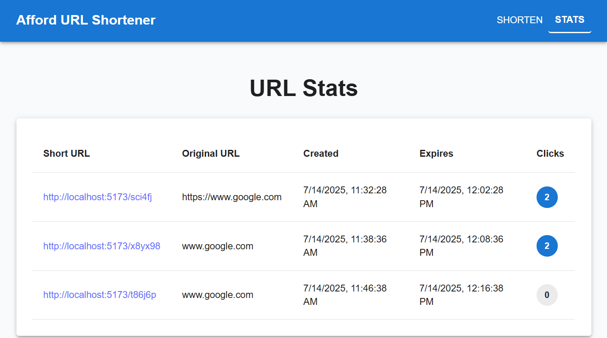
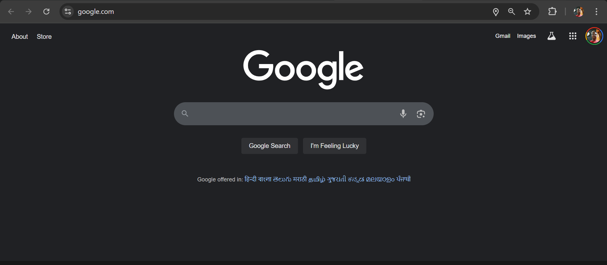

# Afford URL Shortener Backend (loggin-middleware)

This is the backend and logging middleware for the Afford URL Shortener project.

## Features
- Express.js backend for URL shortening, stats, and redirection
- Logging middleware with universal logger (frontend/backend)
- Proxy endpoint to forward logs to the test server
- CORS enabled for local development

## How to Run

1. Install dependencies:
   ```bash
   npm install
   ```
2. Start the backend server:
   ```bash
   node index.js
   ```
   The server runs on `http://localhost:5000`.

## API Endpoints
- `POST /api/shorten` — Shorten one or more URLs
- `GET /api/stats` — Get stats for all shortened URLs
- `GET /api/:code` — Get original URL for a short code
- `POST /api/log` — Proxy logging endpoint for frontend

## Screenshots

### URL Shortener App


### Stats Page


> Place your screenshots in `frontend/screenshots/` and update the paths above if needed.

## Project Structure
- `index.js` — Express backend server
- `logger.js` — Universal logger (browser/Node)
- `logger.node.js` — Node-only logger (for backend)

## License
MIT
